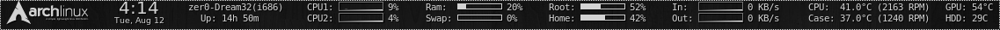

# conky-configs

Some of my old [conky](https://github.com/brndnmtthws/conky) config files which are most likely outdated. I've uploaded them here for archival and sharing purposes.

You will have to edit the .conkyrc files to work with your specific setup. You will also need to be running lm-sensors with appropriate modules for most of the hardware monitoring.

## MintyConkyBar

This is my own modification of [N00by4Ever’s ConkyBar V2.0](https://www.deviantart.com/n00by4ever/art/ConkyBar-Conky-config-Conky-1-10-401254455). The colour and look is directed towards Linux Mint’s default Cinnamon theme. It was designed for a 1920×1080 display.

MintyConkyBar should use less resources than the original ConkyBar as much has been removed. I have removed all lua scripts, clock and text widgets, extra fonts, unused icons, and other shell scripts. All graphs are now conky built-in’s and update interval was changed from 1 to 3 seconds.

## Modified PinguyOS

I really liked the default conky config which comes with [Pinguy OS](http://pinguyos.com/) so I modified it for my own use. It’s worth noting that Pinguy forums has a great conky how-to section that can be helpful.

## Dual Core Colourful

One of the first conky configs I made which I was happy with and used for a long time. The four main graphs (core 1, core 2, eth0 up, eth0 down) are in four distinct colours which work beautifully together.

## Spaced Topbar

This conky config is aimed to be small and take up a similar amount of space as a typical taskbar. Simple but effective!

